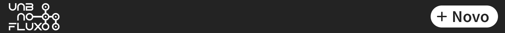

# Arquitetura e Interface

## Arquitetura do projeto
- Para o **frontend**: Será utilizada uma arquitetura do tipo *Single Page Application (SPA)* com estilo *Component-Based Architecture* seguindo o padrão da estrutura de desenvolvimento web baseada em React, Next.js. Além de ser uma aquitetura amplamente utilizada no mercado quando se diz respeito à React, essa escolha foi feita por proporcionar uma experiência de usuário aprimorada pela sua fluidez e responsividade, facilitades em reutilização de código, modularidade e manutenção.

- Para o **backend**: Será utilizada a arquitetura *monolítica* (Aplicação singular), e padrão *Model-View-Controller (MVC)* no projeto.

## Interface do projeto
### Público alvo
O UnBnoFluxo é voltado para os estudantes de Graduação da Universidade de Brasília que, segundo o Censo da Educação Superior de 2018, se refere à 83,9% de pessoas com menos de 24 anos.

### Estrutura da interface e navegabilidade
A interface será organizada majoritariamente em uma aplicação de página única dividida em 3 partes, como poder ser visto no **protótipo de alta fidelidade** a seguir:

**Obs:** Esse prototipo pode ser visto mais detalhadamente pelo figma neste [link](https://www.figma.com/file/gnRnNtiChtjhjkhoRfxnq8/UnBNoFluxo?type=design&node-id=0%3A1&t=jd2LN5wc1D0D32QI-1)

- **Barra de navegação:** Fixada no topo da página, para ajudar a navegabilidade, além de servir de recipiente para botões de para funcionalidades úteis no momento.

- **Conteúdo:** Localizada ao centro da página onde será exibido o fluxograma. Seguindo o estilo arquitetural podemos destacar alguns componentes:

- **Rodapé:** Localizado na parte inferior da página, conterá informações úteis como direitos autorais, informações de contato, entre outros.

Além disso a aplicação também contará com duas **Caixas de dialogo**. Uma exibirá informações detalhadas sobre o componente curricular referente ao qual ela foi gerada, e outra servirá de fomulário para o carregamento de dados.

### Paleta de cores
| Cor          | Código  |
| ------------ | :-----: |
| Branco       | #FFFFFF |
| Preto        | #232323 |
| Cinza        | #DFE1E5 |
| Cinza escuro | #818594 |
| Roxo         | #834DF0 |
| Amarelo      | #FFAF0F |
| Vermelho     | #DB3B4B |
| Azul         | #3574F0 |
| Verde        | #208A3C |

## Histórico de revisão
|   Data   | Versão | Descrição            | Autor   |
| :------: | :----: | -------------------- | ------- |
| 08/05/23 |  1.0   | Criação do documento | Todos   |
| 15/05/23 |  1.1   | Adição prototipo     | Ricardo |
