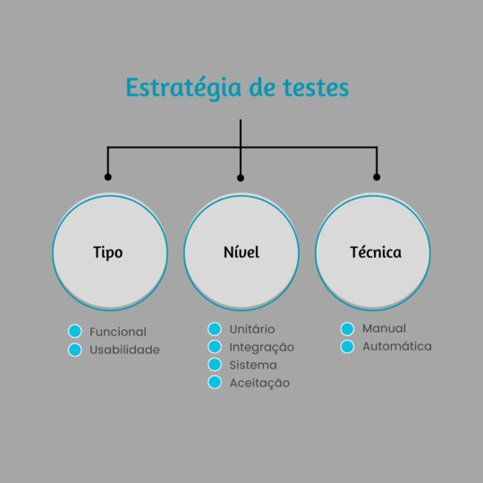

# Integração Contínua e Testes

## Workflow
Um workflow é um fluxo de trabalhos (jobs) que é ativado a partir de um evento (triggers), como por exemplo um pull request, e que executa uma sequência de etapas (steps) podem realizar e automatizar atividades como build, teste e deploy de um projeto.

Para este projeto, a equipe FluxoSquad irá utilizar um workflow para build e testes (unitários e de integração), que serão acionados por pushes e PR's nas branches dev e main.
Como o projeto será desenvolvido em React e Java, a seguinte estrutura de workflow será seguida:

## Estratégia de Testes (TNT)
A abordagem TNT adotada será:          

| Nível      | Tipo        | Técnica    | Objetivo   | Perspectiva | Escopo      |     US                 |
| ---------- | ----------- | ---------- | ---------- | ----------- | ----------- |  --------              |
| Unitário   | Funcional   | Automático | Q. Interna | Técnica     | MVP2        | US09, US14, US10, US07 |
| Integração | Funcional   | Automático | Q. Interna | Técnica     | MVP2        | US09 e US10            |
| Sistema    | Funcional   | Manual     | Q. Externa | Técnica     | MVP1 & MVP2 |                        |
| Aceitação  | Funcional   | Manual     | Q. Externa | Negócio     | MVP1 & MVP2 |                        |
| Sistema    | Usabilidade | Manual     | Q. Externa | Técnica     | MVP1 & MVP2 |                        |
| Aceitação  | Usabilidade | Manual     | Q. Externa | Negócio     | MVP1 & MVP2 |                        |

## Histórico de revisão

|   Data   | Versão | Descrição                      | Autor    |
| :------: | :----: | ------------------------------ | -------- |
| 17/05/23 |  1.0   | Criação do documento           | Vinicius |
| 26/06/23 |  1.1   | Estretégia de testes e edição  | Vinicius |
| 04/07/23 |  1.2   | Objetivo e perspectiva dos TNT | Vinicius |
| 19/07/23 |  1.3   | Adicionando US ao escopo       | João     |
