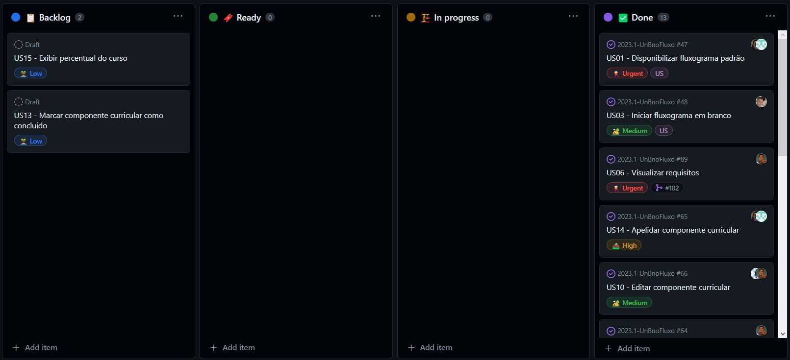

# Sprint 8

## Visão Geral

|  Início  |   Fim    |  Duração  |
| :------: | :------: | :-------: |
| 27/06/23 | 11/07/23 | 2 semanas |

## Sprint Planning
**PAPEIS**

| Papel       | Responsável                                 |
| ----------- | ------------------------------------------- |
| Dev Master  | João Victor                                 |
| Dev CI-Test | Vinicius                                    |
| Dev Back    | Israel e Pedro Paulo                        |
| Dev Front   | Ricardo                                     |
| Cliente     | Pedro Victor, Luis Felipe, George Marsicano |

**OBJETIVOS DA SPRINT**

- US05 - Reordernar componentes curriculares
- US06 - Visualizar requisitos
- US08 - Visualizar carga horária
- US12 - Pesquisar componente curricular
- Testes que faltam
- Polimento e expansão da base de dados

**KANBAN NA PLANNING**

**COMO VAMOS NOS ORGANIZAR PARA ALCANÇAR ESSES OBJETIVOS?**

| Atividade                                                   | Quem            |
| ----------------------------------------------------------- | --------------- |
| Reordernar componentes curriculares e Visualizar requisitos | Ricardo         |
| Visualizar carga horária e Pesquisar componente curricular  | João            |
| Testes que faltam                                           | Vinicius e João |
| Polimento e expansão da base de dados                       | Pedro e Israel  |

## Sprint Review
**ENTREGAS**
- US05 - Reordernar componentes curriculares
- US06 - Visualizar requisitos
- US08 - Visualizar carga horária
- US12 - Pesquisar componente curricular
- Polimento e expansão da base de dados

**KANBAN PÓS REVIEW**

**NÃO FOI ENTREGUE**
- tudo foi entregue

**O CLIENTE DEU ALGUMA SUGESTÃO OU FEZ UM NOVO PEDIDO QUE POSSA MELHORAR O PROJETO?**
- Não houve sugestões, apenas agradecimentos

**FEEDBACK DO CLIENTE EM RELAÇÃO AO PROJETO FINAL**
- Cliente gostou da usabilidade de cada US. Nos disse que o projeto se tornou para o dia a dia e que
ficou melhor do que eles esperavam. foi um feedback breve e direto.

## Sprint Retrospective
**OQUE USAMOS NESSA SPRINT QUE DEVEMOS CONTINUAR PRATICANDO?**
- Pair programming ( ricardo e vinicius | joao e ricardo | israel e pedro | joao e vinicius )
- Design simples
- Propriedade coletiva
- Integração continua
- Planejamento do jogo
- Refatoração
- Padrao de codificação documentado
- Ritmo sustentável
- Testes
    
**O QUE APRENDEMOS DURANTE ESSA SPRINT?**
- usar drag and drop no react (ricardo)
- manipulações com funções (joao)

**HOUVE ALTERAÇÕES NO BACKLOG OU NO VISÃO?**
-Sim, mudamos os criterios de aceitação da us06 ao inves de "clicar", colocamos "interagir" e adicionamos um feito: visualizar pós-requisitos